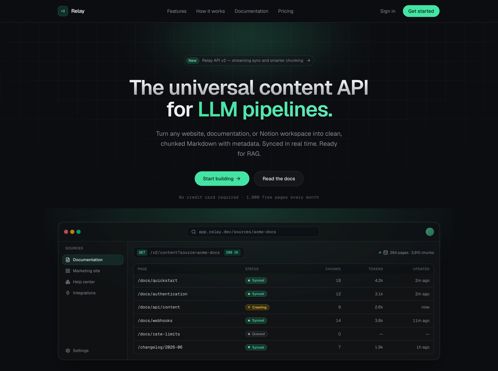
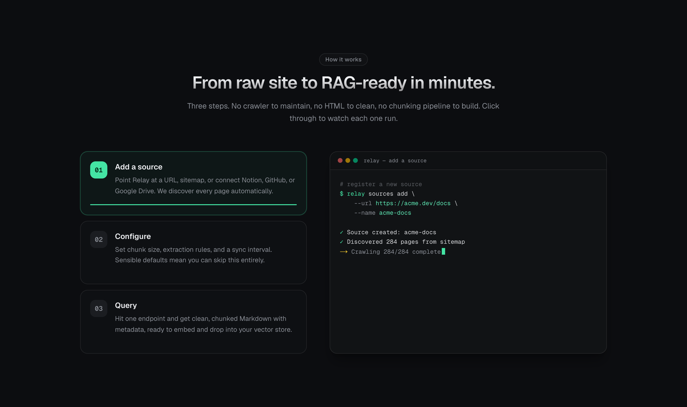
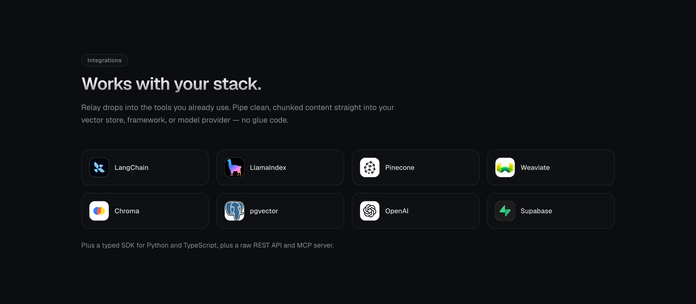
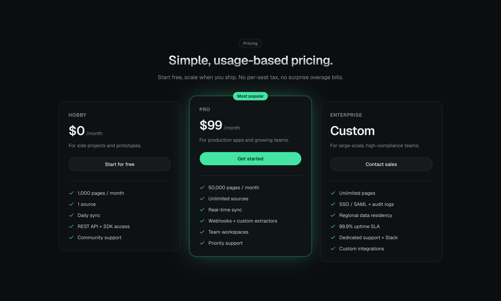

<div align="center">

# Relay

### The universal content API for LLM pipelines

Turn any website, documentation, or Notion workspace into clean, chunked Markdown with metadata. Synced in real time. Ready for RAG.


</div>



## Overview

Relay is a dark themed, single page marketing site for a fictional content API. It is built to feel like a real, shipped product page: every section has intentional copy, the interactive pieces actually run, and the whole thing is responsive from a 375px phone to a wide desktop. There is no Lorem Ipsum anywhere.

The page is fully static and prerenders at build time. The two auth routes are the only dynamic surface.

## Highlights

- **Interactive "How it works"** that you click through. Each step types its command into a live terminal with a blinking caret, fills a progress bar, and auto advances until you take over.
- **Live "Instant updates" feed** that streams realistic content changes into the index with aging timestamps, so the "reflected within seconds" claim is shown rather than asserted.
- **Animated stat counters** that count up on scroll, plus scroll reveal entrances and hover lift on every card.
- **Real integration logos** for LangChain, LlamaIndex, Pinecone, Weaviate, Chroma, pgvector, OpenAI, and Supabase, served locally.
- **Working auth pages** at `/sign-in` and `/get-started` with a split brand panel, OAuth buttons, inline validation, a success state, and plan aware deep linking from the pricing cards.
- **Accessible and considerate.** Buttons are real buttons, the menu is keyboard friendly, and everything that moves respects `prefers-reduced-motion`.
- **One token theming.** The accent is a single `--brand` variable. Change it once to reskin the entire site.

## A look around

<table>
  <tr>
    <td width="50%" valign="top">
      
      <p align="center"><sub><b>How it works.</b> Clickable steps drive a self typing terminal.</sub></p>
    </td>
    <td width="50%" valign="top">
      
      <p align="center"><sub><b>Integrations.</b> Real brand marks, served locally.</sub></p>
    </td>
  </tr>
</table>



## Tech stack

- [Next.js 16](https://nextjs.org) with the App Router and Turbopack
- React 19 and TypeScript 5
- Tailwind CSS v4
- [shadcn/ui](https://ui.shadcn.com) on Base UI (Button, Card, Badge, Accordion, Separator, Input, Label)
- [lucide-react](https://lucide.dev) icons

## Getting started

```bash
npm install
npm run dev      # http://localhost:4317
```

Other scripts:

```bash
npm run build    # production build, type check, and prerender
npm run lint     # eslint
npm start        # serve the production build on http://localhost:4317
```

> The dev and start servers are pinned to port 4317. Port 3000 is intentionally avoided.

## Project structure

```
src/
  app/
    layout.tsx              # fonts, metadata, dark theme
    globals.css             # design tokens (brand + dark palette), keyframes, utilities
    page.tsx                # landing page composition
    sign-in/page.tsx        # sign in route
    get-started/page.tsx    # sign up route (reads ?plan= for deep linking)
  components/
    logo.tsx                # Relay wordmark and signal mark
    reveal.tsx              # scroll reveal wrapper
    count-up.tsx            # count to value on scroll
    ui/                     # shadcn primitives + section helpers
    auth/                   # auth shell, forms, shared auth UI
    sections/               # one file per landing section
public/
  logos/                    # locally served integration logos
docs/
  screenshots/              # README images
```

## Routes

| Route | Rendering | Notes |
| --- | --- | --- |
| `/` | Static | The full landing page |
| `/sign-in` | Static | Sign in with email or OAuth |
| `/get-started` | Dynamic | Sign up, reads `?plan=hobby\|pro\|enterprise` |

## Theming

The palette lives as CSS variables in [`src/app/globals.css`](src/app/globals.css). The accent is a single `--brand` token exposed to Tailwind as `bg-brand`, `text-brand`, `border-brand`, and so on. Swap that one value to change the entire site's accent. The page is dark only by design.

## Notes

- The forms are front end demos. They validate input and show a realistic confirmation state, but they do not call a backend.
- The integration logos are the trademarks of their respective owners and are shown for illustrative "works with" purposes. Replace or remove any on request by dropping a new file into `public/logos/`.

## License

[MIT](LICENSE)
